# Multi-Agent Insurance MCP Architecture

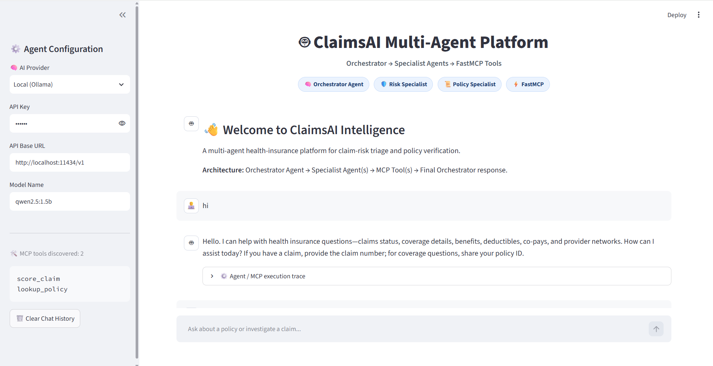
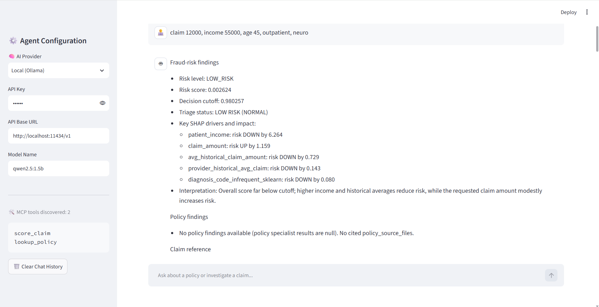
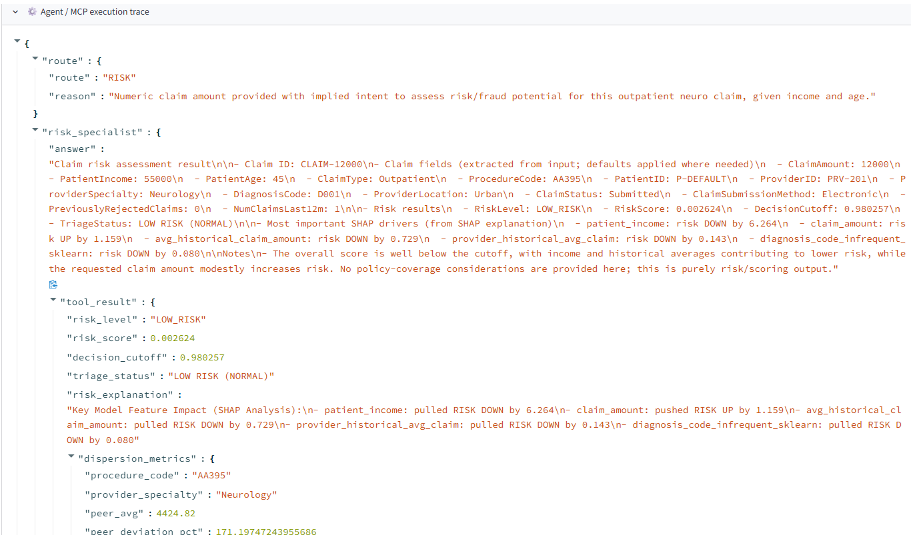
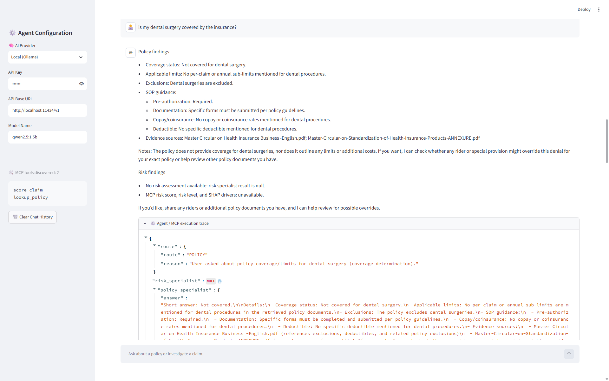
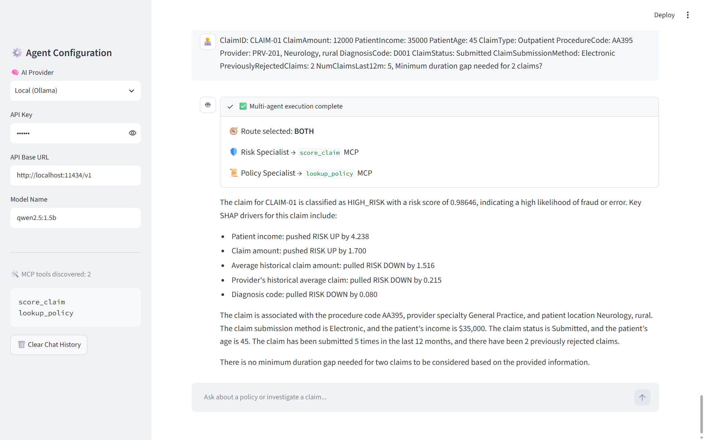

<video controls src="streamlit-app_chat-2026-09-02-20-08-31.webm" title="Title"></video>

An end-to-end **Insurance Claims Risk & Investigation Assistant** that combines:

* Multi-agent orchestration with **LangGraph**
* Specialized **Risk** and **Policy** agents
* **FastMCP** capability services
* ML-based fraud detection
* **SHAP** explainability
* Hybrid **RAG** with Weaviate
* Cross-encoder reranking
* Local **Qwen** grounded generation
* Streamlit-based chat interface

The system follows a clear architectural separation:

> **Orchestrator Agent decides → Specialist Agent solves → MCP Tool invokes → Backend Capability executes → Specialist interprets → Orchestrator synthesizes**

---

# 1. Architecture

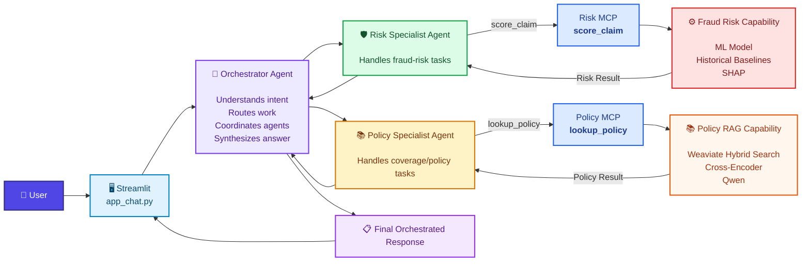

---

# 2. Architectural Principles

The architecture separates **reasoning**, **tool access**, and **domain execution**.

## Orchestrator Agent

The Orchestrator is the central decision-maker.

It is responsible for:

* Understanding the user's request
* Determining whether the request is:

  * `DIRECT`
  * `RISK`
  * `POLICY`
  * `BOTH`
* Selecting the appropriate specialist agent(s)
* Running Risk and Policy specialists in parallel when both are required
* Receiving specialist results
* Producing the final answer

The Orchestrator **does not directly execute the domain capabilities**.

---

## Risk Specialist Agent

The Risk Specialist handles:

* Fraud detection
* Claim risk scoring
* Triage
* Risk explanation
* SHAP interpretation

It receives:

* User request
* Claim details
* Relevant claim context

It calls:

```text
score_claim
```

through the Risk MCP service.

---

## Policy Specialist Agent

The Policy Specialist handles:

* Coverage questions
* Policy limits
* Exclusions
* Procedure-related rules
* Policy/SOP guidance

It receives:

* User policy question
* Claim type
* Procedure information
* Optional claim context

It calls:

```text
lookup_policy
```

through the Policy MCP service.

---

# 3. Runtime Request Flow

## 3.1 Risk-only request

Example:

> Is this $25,000 claim suspicious?

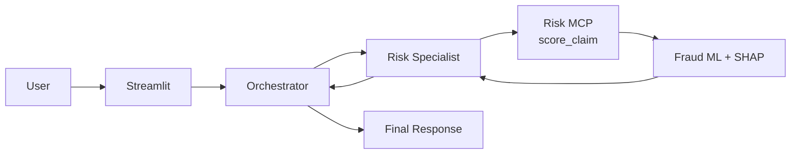

---

## 3.2 Policy-only request

Example:

> Is outpatient treatment covered under the policy?

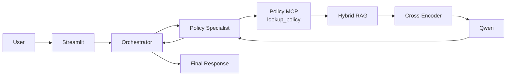

---

## 3.3 Dual-intent request

Example:

> Assess whether this claim is fraudulent and tell me whether the treatment is covered.

The Orchestrator can invoke both specialists independently.

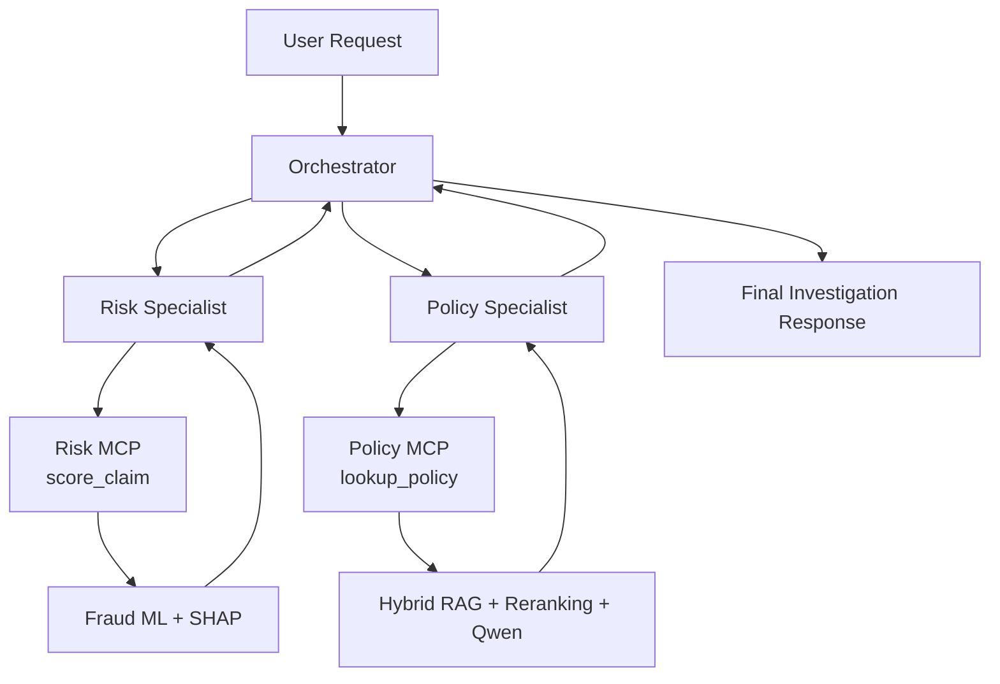

This allows the two specialist paths to execute concurrently when appropriate.

---

# 4. Agent Routing

The Orchestrator uses four logical routes.

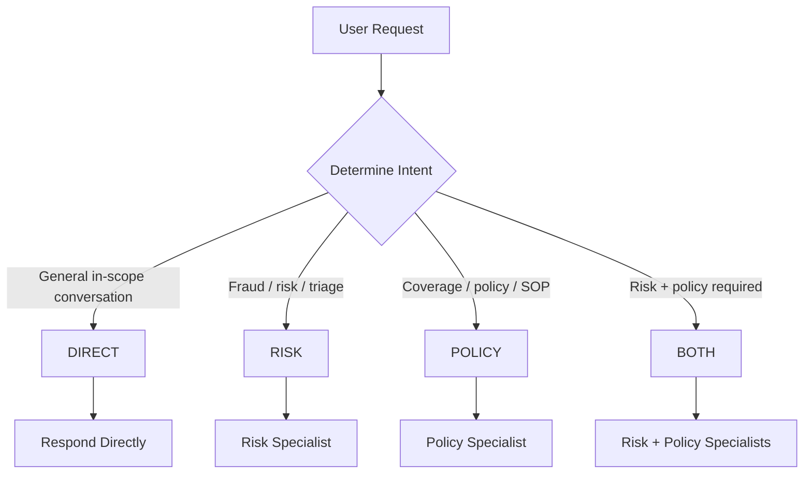

Examples:

| User request                                               | Route    |
| ---------------------------------------------------------- | -------- |
| `"Hi"`                                                     | `DIRECT` |
| `"Is this claim suspicious?"`                              | `RISK`   |
| `"What is the outpatient coverage limit?"`                 | `POLICY` |
| `"Is this claim suspicious and is the treatment covered?"` | `BOTH`   |

---

# 5. Specialist Agent Responsibilities

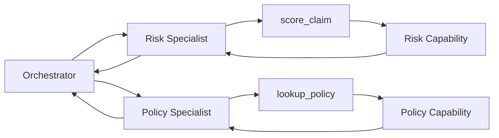

### Risk Specialist

**Input**

```text
User task
+
Claim context
```

**Action**

```text
Call score_claim
Interpret ML + SHAP result
```

**Output**

```text
Risk level
Risk score
Decision cutoff
Triage status
Risk explanation
```

### Policy Specialist

**Input**

```text
Policy question
+
Claim type
+
Procedure/context
```

**Action**

```text
Call lookup_policy
Interpret retrieved evidence
```

**Output**

```text
Grounded policy answer
Relevant documents
Source information
Reranking information
```

---

# 6. MCP Architecture

MCP is the **capability access layer**.

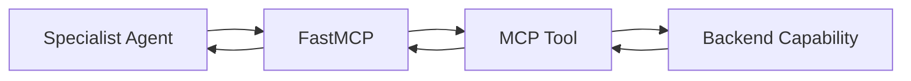

MCP is responsible for:

* Tool discovery
* Tool schemas
* Input validation
* Transport
* Capability invocation
* Structured responses

MCP is **not responsible for orchestration**.

The MCP server does not decide:

* Which agent should run
* Which specialist should run next
* Whether Risk or Policy is required
* How the final response should be synthesized

Those decisions belong to the agents.

---

# 7. Risk Capability

The Risk MCP exposes:

```text
score_claim
```

The underlying capability performs:

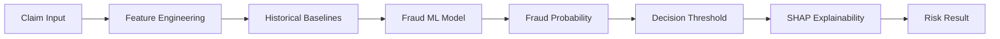

The risk capability uses information such as:

* Claim amount
* Patient income
* Patient age
* Claim type
* Procedure code
* Patient history
* Provider history
* Provider specialty
* Historical claim averages
* Peer deviation
* Previous rejected claims
* Claim frequency

---

# 8. Risk MCP Response

Conceptual response:

```json
{
  "claim_id": "CLM-123",
  "risk_level": "HIGH_RISK",
  "risk_score": 0.87,
  "decision_cutoff": 0.42,
  "triage_status": "HIGH RISK (SUSPICIOUS)",
  "risk_explanation": "Key model feature impact..."
}
```

The actual values are generated by the trained fraud model and SHAP engine.

---

# 9. Policy Capability

The Policy MCP exposes:

```text
lookup_policy
```

The policy capability performs:

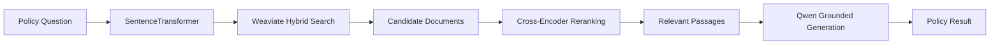

The policy retrieval system combines:

* Dense semantic retrieval
* BM25 / keyword retrieval
* Cross-encoder reranking
* Grounded LLM generation

The knowledge collection is:

```text
InsuranceKnowledge
```

---

# 10. Policy MCP Response

Conceptual response:

```json
{
  "question": "Is outpatient treatment covered?",
  "answer": "Grounded policy answer...",
  "retrieved_docs": [
    {
      "source_file": "coverage_rules.pdf",
      "category": "Outpatient",
      "snippet": "...",
      "rerank_score": 91.4
    }
  ]
}
```

Policy answers should be grounded in retrieved policy evidence.

---

# 11. Final Response Synthesis

Specialist outputs return to the Orchestrator.

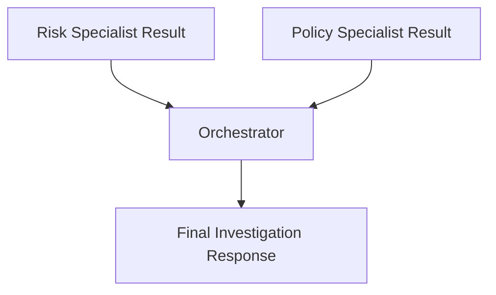

For a dual-intent investigation, the final answer can contain:

```text
Fraud Risk Triage
-----------------
Risk Level: HIGH_RISK
Risk Score: 87%

Key Risk Drivers:
...

Policy Coverage & Limits
------------------------
Coverage:
...

Sources:
- coverage_rules.pdf
- policy_guidelines.pdf
```

---

# 12. Technology Stack

| Layer               | Technology                     |
| ------------------- | ------------------------------ |
| UI                  | Streamlit                      |
| Agent orchestration | LangGraph                      |
| Agent LLM           | OpenAI-compatible LLM / Ollama |
| MCP framework       | FastMCP                        |
| Fraud model         | XGBoost / LightGBM             |
| Explainability      | SHAP                           |
| Feature engineering | Pandas / NumPy                 |
| Embeddings          | Sentence Transformers          |
| Vector database     | Weaviate                       |
| Retrieval           | Hybrid Dense + BM25            |
| Reranking           | Cross-Encoder                  |
| Policy generation   | Qwen2.5-1.5B-Instruct          |
| Model artifacts     | Joblib                         |
| Environment         | Python / Docker                |

---

# 13. Repository Structure

```text
AgenticAI_training/
│
├── Health Insurance Fraud Claims.xlsx
│
├── train_fraud_model.py
├── insurance_multi_agent_chunking_indexing.py
├── insurance_mcp_server.py
├── app_chat.py
├── generate_rag_pdfs.py
├── docker-compose.yml
├── requirements.txt
├── README.md
│
├── rag/
│   └── documents/
│       └── *.pdf
│
└── output/
    ├── fraud_detection_model.pkl
    └── processed_claim_features.csv
```

---

# 14. File Responsibilities

| File                                         | Responsibility                                                                                        |
| -------------------------------------------- | ----------------------------------------------------------------------------------------------------- |
| `app_chat.py`                                | Streamlit UI, Orchestrator Agent, Risk Specialist, Policy Specialist, MCP clients and final synthesis |
| `insurance_mcp_server.py`                    | FastMCP server exposing `score_claim` and `lookup_policy`                                             |
| `insurance_multi_agent_chunking_indexing.py` | Fraud and policy capability implementations                                                           |
| `train_fraud_model.py`                       | Fraud-model training, feature engineering and SHAP artifact generation                                |
| `generate_rag_pdfs.py`                       | Generates sample policy documents for RAG                                                             |
| `Health Insurance Fraud Claims.xlsx`         | Historical claims dataset                                                                             |
| `output/fraud_detection_model.pkl`           | Trained ML runtime artifact                                                                           |
| `output/processed_claim_features.csv`        | Processed claims data                                                                                 |
| `rag/documents/`                             | Policy documents used by RAG                                                                          |

---

# 15. Installation

Clone the repository:

```bash
git clone https://github.com/tigersb06/AgenticAI_training.git
cd AgenticAI_training
```

Create a virtual environment.

### Linux / macOS

```bash
python3 -m venv venv
source venv/bin/activate
```

### Windows

```bash
python -m venv venv
venv\Scripts\activate
```

Upgrade pip:

```bash
python -m pip install --upgrade pip
```

Install dependencies:

```bash
pip install -r requirements.txt
```

---

# 16. Start Weaviate

The Policy capability requires Weaviate.

Using Docker Compose:

```bash
docker compose up -d
```

Verify:

```bash
docker ps
```

The policy RAG system expects:

```text
InsuranceKnowledge
```

as the knowledge collection.

---

# 17. Prepare Policy Documents

Generate the sample policy PDFs:

```bash
python generate_rag_pdfs.py
```

Or place your own documents in:

```text
rag/documents/
```

Example:

```text
rag/
└── documents/
    ├── coverage_rules.pdf
    ├── exclusions.pdf
    ├── claim_limits.pdf
    ├── policy_guidelines.pdf
    └── documentation_requirements.pdf
```

---

# 18. Train the Fraud Model

Run:

```bash
python train_fraud_model.py
```

Input:

```text
Health Insurance Fraud Claims.xlsx
```

Generated runtime artifacts:

```text
output/
├── fraud_detection_model.pkl
└── processed_claim_features.csv
```

The trained artifact must exist before Risk MCP is used.

---

# 19. Build the RAG Index

Run:

```bash
python insurance_multi_agent_chunking_indexing.py
```

Conceptually:

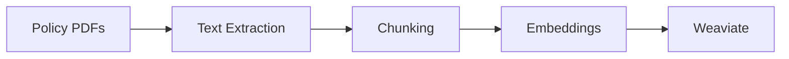

Runtime retrieval:

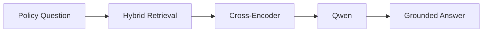

---

# 20. Start FastMCP

Start the MCP service:

```bash
python insurance_mcp_server.py
```

Default endpoint:

```text
http://127.0.0.1:8011/mcp
```

Available tools:

```text
score_claim
lookup_policy
```

The MCP server should remain running while the application is active.

---

# 21. Start Streamlit

In another terminal:

```bash
streamlit run app_chat.py
```

The UI provides:

* Natural-language interaction
* Agent routing
* Risk analysis
* Policy analysis
* Dual-intent execution
* MCP tool execution tracing
* Final response synthesis

---

# 22. Recommended Startup Order

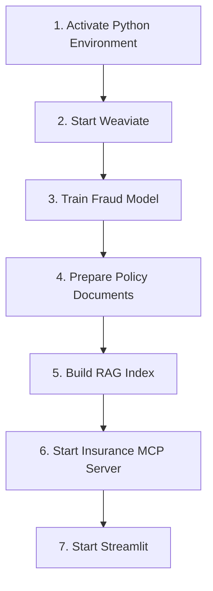

Commands:

```bash
source venv/bin/activate

docker compose up -d

python train_fraud_model.py

python generate_rag_pdfs.py

python insurance_multi_agent_chunking_indexing.py

python insurance_mcp_server.py
```

Then, in another terminal:

```bash
source venv/bin/activate
streamlit run app_chat.py
```

---

# 23. MCP Tools

## `score_claim`

Purpose:

```text
Fraud risk scoring and explainability
```

Typical inputs include:

```text
claim_amount
patient_income
patient_age
claim_type
claim_id
procedure_code
patient_id
provider_id
provider_specialty
diagnosis_code
provider_location
claim_status
claim_submission_method
previously_rejected_claims
num_claims_last_12m
```

Returns:

```text
risk_level
risk_score
decision_cutoff
triage_status
risk_explanation
```

---

## `lookup_policy`

Purpose:

```text
Policy retrieval and grounded policy synthesis
```

Typical inputs:

```text
question
claim_type
procedure_code
```

Returns:

```text
answer
retrieved_docs
source information
reranking information
```

---

# 24. Agent Input / Output Summary

| Agent             | Input                      | MCP Tool          | Output                            |
| ----------------- | -------------------------- | ----------------- | --------------------------------- |
| Orchestrator      | User query + claim context | Specialist agents | Final response                    |
| Risk Specialist   | Risk task + claim details  | `score_claim`     | Risk result + explanation         |
| Policy Specialist | Policy question + context  | `lookup_policy`   | Grounded policy result + evidence |

---

# 25. Architecture Rule

The core design principle is:

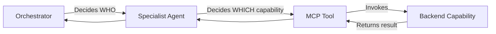

### In one line:

> **Agent decides → MCP invokes → backend executes → Agent interprets → Orchestrator synthesizes**

The architecture intentionally avoids:

```text
MCP → Agent
```

and instead uses:

```text
Orchestrator → Specialist Agent → MCP → Capability
```

---

# 26. Error Handling

## Missing Fraud Model

If the application reports that:

```text
output/fraud_detection_model.pkl
```

is missing, run:

```bash
python train_fraud_model.py
```

---

## MCP Connection Error

Ensure:

```bash
python insurance_mcp_server.py
```

is running.

Verify the endpoint:

```text
http://127.0.0.1:8011/mcp
```

---

## Weaviate Connection Error

Check Docker:

```bash
docker ps
```

Ensure the Weaviate container is running.

---

## Empty Policy Results

Check:

* Weaviate is running
* Policy documents exist
* RAG indexing has been executed
* `InsuranceKnowledge` exists
* `lookup_policy` is available through MCP

---

# 27. Production Considerations

For production deployment, consider:

* MCP authentication
* Tool-level authorization
* API-key / secret management
* Request IDs and correlation IDs
* Structured logging
* MCP audit logging
* Rate limiting
* Model version tracking
* RAG document versioning
* Model drift monitoring
* Retrieval-quality monitoring
* Human approval for high-risk claims
* Data privacy controls

The current implementation is primarily an end-to-end architecture and working prototype.

---

# 28. Final Architecture Summary

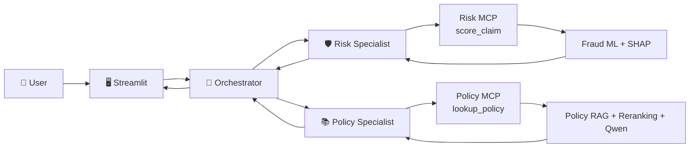

## Core Principle

> **The Orchestrator decides which specialist should work.
> The Specialist Agent decides which capability it needs.
> MCP exposes that capability as a tool.
> The backend performs the work.
> The result returns to the Specialist, then to the Orchestrator for final synthesis.**
