# Multi-Agent Insurance MCP Architecture

An end-to-end **Insurance Claims Risk & Investigation Assistant** that combines fraud-detection ML, SHAP explainability, policy RAG, LangGraph orchestration, FastMCP services, and a Streamlit interface.

---

## Architecture

```mermaid
flowchart LR

    %% =========================
    %% USER & CLIENT
    %% =========================

    USER(("👤 User"))

    subgraph CLIENT["🖥️ Client & Interaction Layer"]
        direction TB
        UI["🌐 Streamlit Dashboard"]
        CLI["⌨️ Async CLI Client"]
        NLP["🧠 NLP Slot Extraction"]
        FORM["📝 Slot Filling"]
        ROUTER{"🔀 Claim Router"}
    end

    USER --> UI
    USER --> CLI

    UI --> NLP
    CLI --> NLP
    NLP --> FORM
    FORM --> ROUTER


    %% =========================
    %% MCP LAYER
    %% =========================

    subgraph MCP["⚡ FastMCP Service Layer"]
        direction TB
        LAUNCH["🚀 MCP Process Launcher"]

        subgraph SERVICES["Concurrent MCP Services"]
            direction LR
            RISK_MCP["🛡️ Risk MCP<br/>score_claim"]
            POLICY_MCP["📚 Policy MCP<br/>lookup_policy"]
        end
    end

    LAUNCH --> RISK_MCP
    LAUNCH --> POLICY_MCP

    ROUTER -->|"Claim > 0"| RISK_MCP
    ROUTER -->|"Claim > 0"| POLICY_MCP
    ROUTER -->|"Policy Only"| POLICY_MCP


    %% =========================
    %% RISK SYSTEM
    %% =========================

    subgraph RISK["🛡️ Fraud Risk & Explainability"]
        direction TB

        RISK_AGENT["Risk Agent"]
        MODEL["🤖 Fraud Detection Model"]
        SHAP["📊 SHAP Explainability"]

        RISK_AGENT --> MODEL
        MODEL --> SHAP
    end

    RISK_MCP --> RISK_AGENT
    SHAP -->|"Risk Score + Explanation"| RISK_MCP


    %% =========================
    %% POLICY RAG
    %% =========================

    subgraph RAG["📚 Policy RAG & Grounded Reasoning"]
        direction TB

        POLICY_AGENT["Policy Agent"]
        EMBED["🔢 Sentence Transformer"]
        DB[("🗄️ Weaviate")]
        RERANK["🎯 Cross Encoder Reranker"]
        LLM["🧠 Qwen Local LLM"]

        POLICY_AGENT --> EMBED
        EMBED --> DB
        DB --> RERANK
        RERANK --> LLM
    end

    POLICY_MCP --> POLICY_AGENT
    LLM -->|"Grounded Policy Answer"| POLICY_MCP


    %% =========================
    %% RESULT
    %% =========================

    STATUS["📡 Live MCP Tool Tracking"]
    RESULT["📋 Consolidated Investigation Result"]

    RISK_MCP --> STATUS
    POLICY_MCP --> STATUS
    STATUS --> RESULT
    RESULT --> USER


    %% =========================
    %% STYLES
    %% =========================

    classDef user fill:#4F46E5,color:#fff,stroke:#312E81,stroke-width:2px;
    classDef client fill:#E0F2FE,color:#0C4A6E,stroke:#0284C7,stroke-width:2px;
    classDef mcp fill:#DCFCE7,color:#14532D,stroke:#16A34A,stroke-width:2px;
    classDef risk fill:#FEE2E2,color:#7F1D1D,stroke:#DC2626,stroke-width:2px;
    classDef rag fill:#FEF3C7,color:#78350F,stroke:#D97706,stroke-width:2px;
    classDef result fill:#F3E8FF,color:#581C87,stroke:#9333EA,stroke-width:2px;

    class USER user;
    class UI,CLI,NLP,FORM,ROUTER client;
    class LAUNCH,RISK_MCP,POLICY_MCP mcp;
    class RISK_AGENT,MODEL,SHAP risk;
    class POLICY_AGENT,EMBED,DB,RERANK,LLM rag;
    class STATUS,RESULT result;

```



---

# AgenticAI_training

This project implements an end-to-end **Insurance Claims Risk & Investigation Assistant**.

The system combines:

* Tabular ML fraud detection
* Historical claim baselines and feature engineering
* SHAP explainability
* LangGraph multi-agent orchestration
* Hybrid RAG with Weaviate
* Dense embeddings and BM25 retrieval
* Cross-encoder reranking
* Local Qwen LLM generation
* FastMCP servers and tools
* Streamlit UI and CLI clients

A user can submit either a natural-language claim description or a structured claim. The system can then assess fraud risk, explain the prediction, retrieve relevant policy information, and return a consolidated investigation result.

---

# 1. High-Level Runtime Flow

```text
User
  ↓
Streamlit UI / Async CLI
  ↓
NLP Slot Extraction
  ↓
Slot-Filling Refinement
  ↓
Auto-Routing
  │
  ├── Claim Amount = $0
  │      ↓
  │   Policy MCP
  │      ↓
  │   Policy Agent
  │      ↓
  │   Weaviate Hybrid RAG
  │      ↓
  │   Cross-Encoder Reranking
  │      ↓
  │   Qwen LLM
  │
  └── Claim Amount > $0
         ↓
      Risk MCP + Policy MCP
         │
         ├── Risk MCP
         │    ↓
         │  ML Fraud Scoring
         │    ↓
         │  SHAP Explanation
         │
         └── Policy MCP
              ↓
           Policy RAG
              ↓
         Cross-Encoder Reranking
              ↓
            Qwen LLM
              ↓
       Consolidated Investigation Result

```

For claim requests, the risk and policy services can run concurrently through `asyncio.gather()`.

---

# 2. Repository Structure

The core project contains:

```text
AgenticAI_training/
│
├── Health Insurance Fraud Claims.xlsx
├── train_fraud_model.py
├── insurance_multi_agent_chunking_indexing_copy_2.py
├── insurance_risk_server.py
├── insurance_policy_server.py
├── start_insurance_mcp.py
├── insurance_multi_agent_client.py
├── streamlit_app.py
├── generate_rag_pdf.py
├── README.md
│
└── output/
    ├── fraud_detection_model.pkl
    └── processed_claim_features.csv

```

---

# 3. Clone or Fork the Repository

## 3.1 Clone

```bash
git clone https://github.com/tigersb06/AgenticAI_training.git
cd AgenticAI_training

```

## 3.2 Fork

To maintain your own GitHub copy:

1. Open the repository on GitHub.
2. Click **Fork**.
3. Select your GitHub account.
4. Clone your fork:

```bash
git clone https://github.com/<YOUR_USERNAME>/AgenticAI_training.git
cd AgenticAI_training

```

Optional: add the original repository as `upstream`:

```bash
git remote add upstream https://github.com/tigersb06/AgenticAI_training.git
git remote -v

```

---

# 4. Create a Python Environment

A clean virtual environment is recommended.

## Windows

```bash
python -m venv .venv
.venv\Scripts\activate

```

## macOS / Linux

```bash
python3 -m venv .venv
source .venv/bin/activate

```

Upgrade `pip`:

```bash
python -m pip install --upgrade pip

```

---

# 5. Install Dependencies

Install the project dependencies from `requirements.txt`:

```bash
pip install -r requirements.txt

```

The environment covers the major components used by the project, including:

```text
pandas
numpy
scikit-learn
xgboost
lightgbm
shap
joblib
weaviate-client
sentence-transformers
langgraph
transformers
streamlit
fastmcp
pypdf

```

---

# 6. Start Weaviate

The policy RAG system depends on a running local Weaviate instance.

Check Docker:

```bash
docker --version
docker ps

```

If your existing Weaviate container already exists:

```bash
docker start <weaviate-container-name>

```

If the project uses Docker Compose:

```bash
docker compose up -d

```

Verify that the container is running:

```bash
docker ps

```

Weaviate needs to be available before the policy RAG service is started.

The RAG system uses a collection named:

```text
InsuranceKnowledge

```

---

# 7. Prepare the RAG Knowledge Base

The policy agent requires policy documents.

There are two ways to prepare them.

## Option A — Generate the RAG PDFs

Run the project's PDF generation utility:

```bash
python generate_rag_pdf.py

```

## Option B — Add PDFs Manually

Place policy PDFs in the RAG documents directory, for example:

```text
rag/
└── documents/
    ├── coverage_rules.pdf
    ├── exclusions.pdf
    ├── claim_limits.pdf
    ├── required_documentation.pdf
    └── policy_guidelines.pdf

```

---

# 8. Train the Fraud Detection Model

Run:

```bash
python train_fraud_model.py

```

The training script reads:

```text
Health Insurance Fraud Claims.xlsx

```

and builds the ML artifacts used during runtime under `output/`:

```text
output/
├── fraud_detection_model.pkl
└── processed_claim_features.csv

```

Train the fraud model **before starting the FastMCP services or Streamlit app**.

---

# 9. Build or Refresh the RAG Index

Once the PDFs are available, run the project's chunking and indexing pipeline:

```bash
python insurance_multi_agent_chunking_indexing_copy_2.py

```

The indexing flow is:

```text
Policy PDFs
    ↓
Chunking
    ↓
SentenceTransformer
(all-MiniLM-L6-v2)
    ↓
Weaviate
(InsuranceKnowledge)

```

At query time, retrieval follows:

```text
User Query
    ↓
Hybrid Search
(Dense + BM25)
    ↓
Cross-Encoder Reranking
    ↓
Qwen LLM Synthesizer

```

---

# 10. Start the Insurance MCP Services

Launch both FastMCP microservices using the launcher script:

```bash
python start_insurance_mcp.py

```

Expected service mapping:

| Service | Port | Tool |
| --- | --- | --- |
| Insurance Risk MCP Server | 8011+ | `score_claim` |
| Insurance Policy MCP Server | 8012+ | `lookup_policy` |

The launcher is responsible for starting and monitoring the MCP services.

---

# 11. Run the Application

## 11.1 Streamlit Web Dashboard

**Recommended**

In a separate terminal, with the virtual environment activated:

```bash
streamlit run streamlit_app.py

```

Features include:

* Natural-language claim input
* Automatic NLP slot extraction
* Slot-filling refinement
* Auto-routing between policy-only and claim workflows
* Real-time `st.status()` progress tracking
* MCP tool execution tracking
* Interactive SHAP feature contributions
* Grounded policy document excerpts
* Consolidated investigation output

---

## 11.2 Async CLI Client

Alternatively, run the interactive CLI:

```bash
python insurance_multi_agent_client.py

```

The CLI supports:

* Natural-language claim input
* Slot extraction
* Automatic routing
* Risk MCP calls
* Policy MCP calls
* Consolidated results

---

# 12. Recommended Startup Order

Follow this order for a clean end-to-end run.

### Step 1 — Start Weaviate

```bash
docker start <weaviate-container-name>

```

Or:

```bash
docker compose up -d

```

---

### Step 2 — Train the Fraud ML Model

```bash
python train_fraud_model.py

```

This creates:

```text
output/fraud_detection_model.pkl

```

---

### Step 3 — Build or Refresh the Policy RAG Index

Generate the policy PDFs:

```bash
python generate_rag_pdf.py

```

Then index them:

```bash
python insurance_multi_agent_chunking_indexing_copy_2.py

```

---

### Step 4 — Launch FastMCP Services

```bash
python start_insurance_mcp.py

```

Keep this process running.

---

### Step 5 — Run the UI or CLI Client

For Streamlit:

```bash
streamlit run streamlit_app.py

```

Or for the CLI:

```bash
python insurance_multi_agent_client.py

```

---

# 13. Component Directory & File Responsibilities

| Component / File | Responsibility |
| --- | --- |
| `Health Insurance Fraud Claims.xlsx` | Raw historical claims dataset |
| `train_fraud_model.py` | Feature engineering, XGBoost/LightGBM training, SHAP explainer creation |
| `insurance_multi_agent_chunking_indexing_copy_2.py` | LangGraph multi-agent backend, Weaviate hybrid search, Qwen LLM synthesis |
| `insurance_risk_server.py` | FastMCP server for the `score_claim` tool |
| `insurance_policy_server.py` | FastMCP server for the `lookup_policy` tool |
| `start_insurance_mcp.py` | Orchestrator, free-port finder, and MCP health-check launcher |
| `insurance_multi_agent_client.py` | Async CLI client with NLP slot extraction and auto-routing |
| `streamlit_app.py` | Web dashboard with real-time MCP tool tracking and parameter refinement |
| `generate_rag_pdf.py` | Utility to generate standard policy PDFs for RAG indexing |
| `output/fraud_detection_model.pkl` | Trained ML pipeline artifact required at runtime |
| `output/processed_claim_features.csv` | Processed feature dataset generated during model training |

---

# 14. Common Problems & Fixes

## `FileNotFoundError: output/fraud_detection_model.pkl`

Run:

```bash
python train_fraud_model.py

```

This generates the required model artifacts.

---

## `Failed to connect to [http://127.0.0.1:8011/mcp](http://127.0.0.1:8011/mcp)`

Make sure the MCP services are running:

```bash
python start_insurance_mcp.py

```

Keep the MCP launcher running in a separate terminal.

If dynamic ports were assigned, check the launcher output and update the server endpoints used by the client/UI if necessary.

---

## Empty or Irrelevant Policy RAG Answers

Verify that:

1. Weaviate Docker is running.
2. The policy PDFs exist.
3. `generate_rag_pdf.py` has been executed if required.
4. `insurance_multi_agent_chunking_indexing_copy_2.py` has been executed.
5. The `InsuranceKnowledge` collection exists.
6. The Policy MCP server is running.

---

# Core Technologies

```text
Python
Pandas / NumPy
Scikit-learn
XGBoost
LightGBM
SHAP
Joblib
Sentence Transformers
Weaviate
LangGraph
Transformers
Qwen2.5-1.5B-Instruct
Cross-Encoder
Streamlit
FastMCP
Docker

```